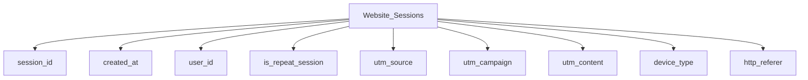
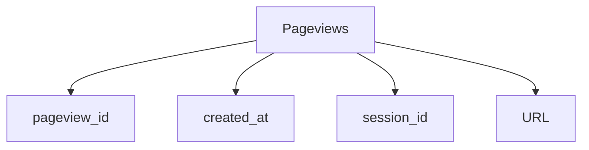

# Project Overview: 
## Web Analytics for Marketing Optimization
In this project, I analyzed website session and conversion data to provide insights into the performance of different traffic sources, user behavior, and the effectiveness of marketing campaigns. By leveraging SQL to extract, analyze, and visualize this data, I uncovered trends and actionable insights to optimize marketing efforts and improve conversion rates.

# Objective
The goal of this project was to analyze website sessions, traffic sources, and conversion performance in order to optimize marketing campaigns, improve user engagement, and maximize revenue from paid and organic channels.

# Data and Approach
Dataset Description
- Website Sessions (website_sessions): Contains session data including the source of traffic, campaign tags, and device information.
- Orders (orders): Includes order details such as session IDs, product information, and order conversion data.
- Website Pageviews (website_pageviews): Captures information on individual page views during each session.

